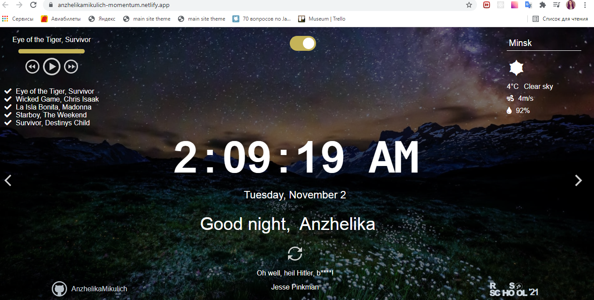
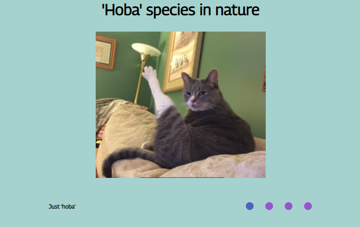
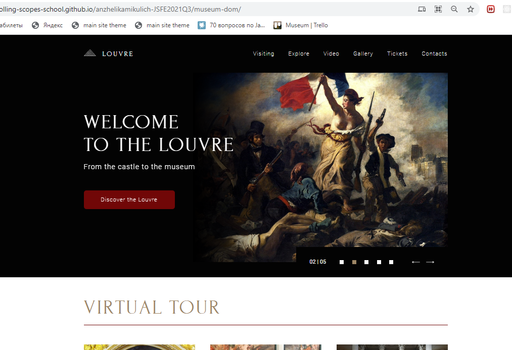
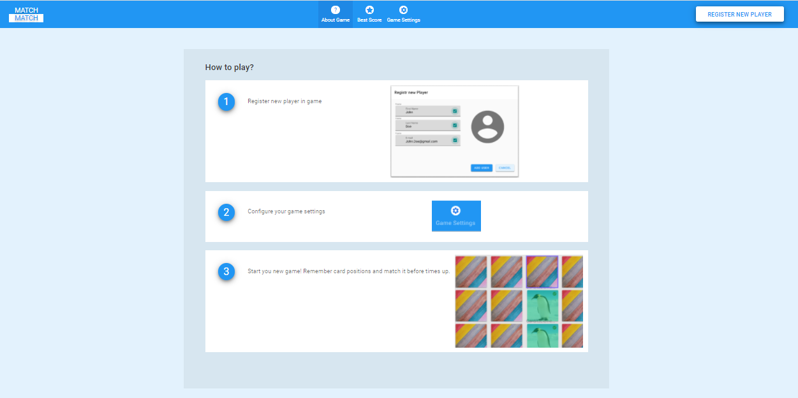
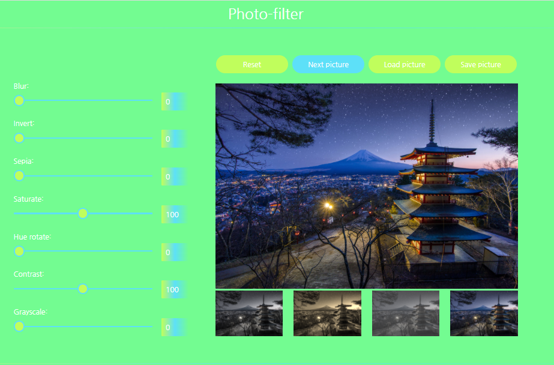
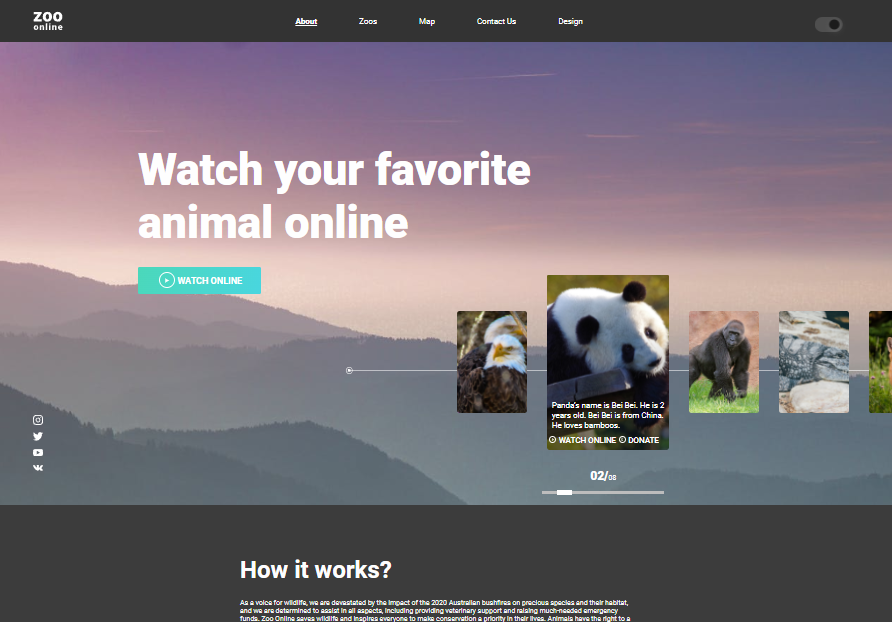
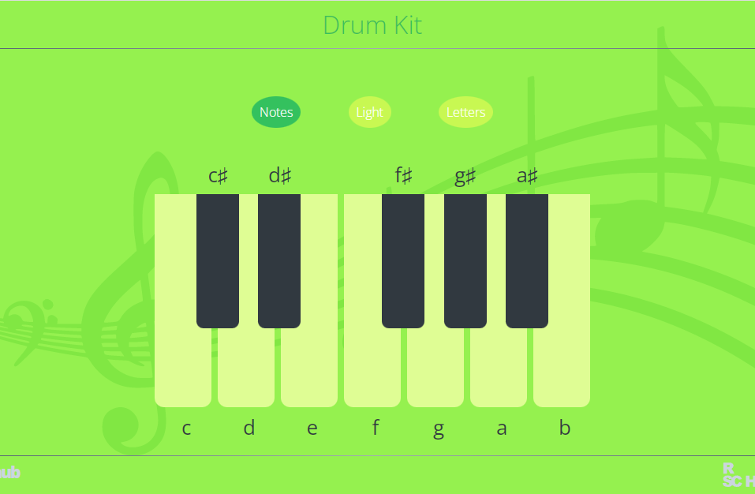
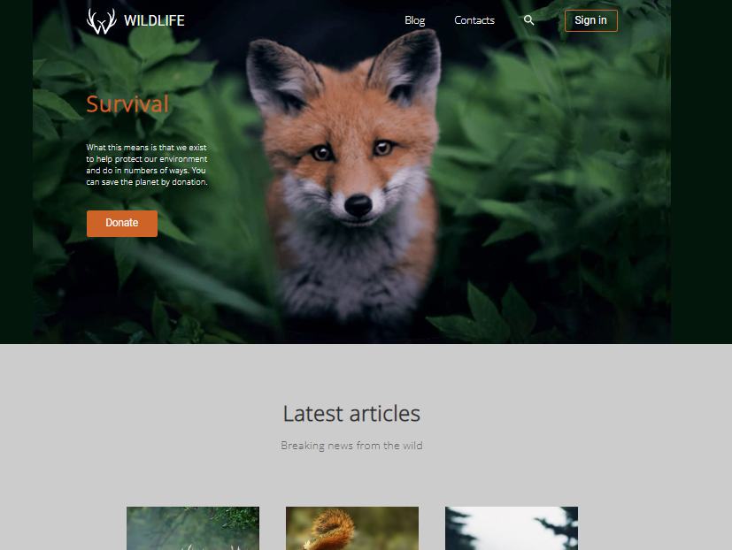

# Portfolio of Mikulich Anzhelika

- [Self introduction](https://www.youtube.com/watch?v=820mRa5XTgQ&ab_channel=%D0%90%D0%BD%D0%B6%D0%B5%D0%BB%D0%B8%D0%BA%D0%B0%D0%A4%D0%BB%D1%91%D1%80%D0%BA%D0%BE)
- [Linkedlin](https://www.linkedin.com/in/anzhelika-mikulich-352153205/)
- [Curriculum Vitae](https://anzhelikamikulich.github.io/rsschool-cv/)
- Portfolio
- [RSSCHool JavaScript Front-end Pre-School sertificate](https://app.rs.school/certificate/qxyy41wd)

## Momentum

<table>
<tr>
    <td>
        <ul>
            <li>Task: https://github.com/rolling-scopes-school/tasks/blob/master/tasks/momentum/momentum-stage1.md</li>
            <li>Work:https://anzhelikamikulich-momentum.netlify.app/</li>
            <li>Key skills: search elements metods,work with date, custom audio player, local storage, use recursive setTimeout, asynk requests, work with weather forecast API, multilanguage</li>
            <li>25.10.2021</li>
    </td>
    <td width="40%">
        
    </td>
</tr>
</table>

## CSS slider

<table border="0">
<tr>
    <td>
        <ul>
            <li>Task: https://github.com/DrDiman/CSS-Mem-Slider</li>
            <li>Work:https://anzhelikamikulich.github.io/cssMemSlider/cssMemSlider/index.html</li>
            <li>Key skills: css slider without JavaScript</li>
            <li>17.10.2021</li>
    </td>
    <td width="40%">
        
    </td>
</tr>
</table>

## Web-site Museum

<table border="0">
<tr>
    <td>
        <ul>
            <li>Task: https://github.com/rolling-scopes-school/tasks/blob/master/tasks/museum/museum-dom.md</li>
            <li>Work: https://rolling-scopes-school.github.io/anzhelikamikulich-JSFE2021Q3/museum-dom/</li>
            <li>Key skills: slider, compare images slider, HTML5 player, gallery animation, tickets calculator, form valudation, interactive map</li>
            <li>10.10.2021</li>
    </td>
    <td width="40%">
        
    </td>
</tr>
</table>

## SPA: Match-Match Game

<table border="0">
<tr>
    <td>
        <ul>
            <li>Task: https://github.com/rolling-scopes-school/tasks/blob/master/tasks/match-match-game.md</li>
            <li>Work: https://anzhelikamikulich-match-match-game.netlify.app/</li>
            <li>Key skills: TypeScript, webpack, OOP</li>
            <li>31.05.2021</li>
    </td>
    <td width="40%">
        
    </td>
</tr>
</table>

## Photo-filter

<table border="0">
<tr>
    <td>
        <ul>
            <li>Task: https://rolling-scopes-school.github.io/stage0/#/stage1/tasks/js-projects/photo-filter</li>
            <li>Work: https://rolling-scopes-school.github.io/anzhelikamikulich-JSFEPRESCHOOL/Fotofilter/</li>
            <li>Key skills: work with files, upload local files, save files to computer, work with Date, Canvas API</li>
            <li>24.04.2021</li>
    </td>
    <td width="40%">
        
    </td>
</tr>
</table>

## Online-zoo - animal observation site

<table border="0">
<tr>
    <td>
        <ul>
            <li>Task: https://rolling-scopes-school.github.io/stage0/#/stage1/tasks/online-zoo/variant-5</li>
            <li>Work: https://anzhelikamikulich.github.io/Online-Zoo/online-zoo/pages/Landing/index.html</li>
            <li>Key skills: layout for desktop skrins, adaptive for 1920px, 1200px. JS: multi-popups whith form, automatic carousel, sliders: horizontal and vertical</li>
            <li>April 2021</li>
    </td>
    <td width="40%">
        
    </td>
</tr>
</table>

## Virtual-piano

<table border="0">
<tr>
    <td>
        <ul>
            <li>Task: https://rolling-scopes-school.github.io/stage0/#/stage1/tasks/js-projects/virtual-piano</li>
            <li>Work:https://rolling-scopes-school.github.io/anzhelikamikulich-JSFEPRESCHOOL/drum-kit/</li>
            <li>Key skills: work with DOM, work with sound, work with Fullscreen API, mouse events, keyboard events</li>
            <li>17.03.2021</li>
    </td>
    <td width="40%">
        
    </td>
</tr>
</table>

## Wildlife

<table border="0">
<tr>
    <td>
        <ul>
            <li>Task: https://rolling-scopes-school.github.io/stage0/#/stage0/tasks/wildlife</li>
            <li>Work:https://anzhelikamikulich-wildlife.netlify.app</li>
            <li>Key skills: work with HTML, CSS, Slider</li>
            <li>10.03.2021</li>
    </td>
    <td width="40%">
        
    </td>
</tr>
</table>
